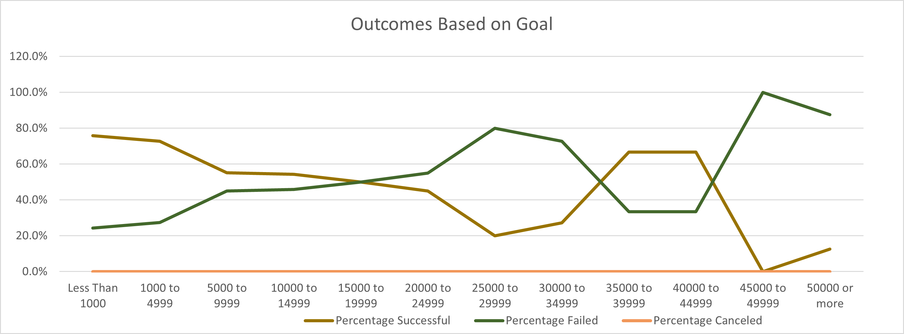

# Kickstarting with Excel
Analysis on Kickstarter campaign data

## Overview of Project
### Purpose
This project aims to examine a substantial kickstarting dataset using Excel to improve the decision-making process for a future campaign. The dataset contains kickstarting campaigns information from various categories, locations, and goals. This analysis used several Excel features, such as formulas, pivot tables, and charts to find trends and provide comprehensive data visualization.

## Analysis and Challenges

The complete analysis can be found on [Kickstarter_Challenge.zip](Kickstarter_Challenge.zip)

### Analysis of Outcomes Based on Launch Date
The goal of this worksheet is to identify the period a campaign is most likely to succeed. It is composed by a pivot table crossing months and outcomes. Category and years were included as filters to bring more relevant results pertaining the future theater campaign. To provide better visualization a line graph were generated using data from the pivot table.
 

 
### Analysis of Outcomes Based on Goals
The purpose of this worksheet is to determine by range the amount of money, targeted by previous projects to identify those with a higher success rate. To generate the table below, the COUNIFS() function was used with outcomes, goals, and a specific subcategory, plays, as parameters. Then the percentage of outcomes for each range was calculated to create a line chart.

### Challenges and Difficulties Encountered
There were no difficulties when developing the charts. However, navigating into the documentation to understand Excel formulas could be challenging to inexperienced professionals. Even the description of a function requires a certain notion of logic, statistics, and math concepts. Still, those difficulties could be surpassed by looking for help online. Because Excel is a well used software among companies and schools around the globe, it is quite easy to find examples and tutorials.
## Results
- What are two conclusions you can draw about the Outcomes based on Launch Date?
   - May is the best month to launch a campaign. Successful campaigns have theresources/Outcomes_vs_Goals.pngir peak on this month, then steadily decrease until September, while failed projects stay relatively stable, even though the total count of campaigns also peaks at the same period. 
   - It is not recommended starting a new project between September and March, but especially December should be avoided, since it is when the lowest point can be observed. On this month, the number of successful campaigns is just slightly higher than the failed ones.
- What can you conclude about the Outcomes based on Goals?
  - Campaigns with lower goals have a higher chance to achieve their goals. Projects in the first two categories (up to $4999) have a success rate of more than 70%, then drop about 20% for projects with goals between $5000 and $9999. It is important to mention that about 85% of goals are less than $10000, which is the reason this conclusion focused only on the first three categories. 
- What are some limitations of this dataset?
  - There are external variables that cannot be measured in the dataset, for example, who are the backers that usually support a certain category and/or subcategory. Demographics and interests might play a part in the success rate. Also, it may be relevant to understand how those backers were targeted. Since the success rate may be the result of the marketing strategy of each crowdfunding campaign.
Additionally, in the chart Outcomes based on Goals, currency was not taken into consideration, which adds a bias in the analysis. It would be beneficial to convert the goal to a common currency or, even, adding a filter by country. Also, this chart does not highlight the outliers, and that may lead to mistakes if examined by itself.
- What are some other possible tables and/or graphs that we could create?
  - To plan a successful campaign would be helpful to create a graph showing how long successful campaigns take to achieve their goals, as well as tables displaying mean and median values of successful theater crowdfunding projects per year aiming to analyze how outcomes change over time.
